# Example

This example demonstrates the process of spectral matching using the `generate_motion_TDBY` function. 

```python
generate_motion_TDBY(
    Ss=0.3,
    S1=0.15,
    soil_class='ZD',
    max_iterations=20,
    max_non_improvement=3,
    duration=40.0,
    dt=0.01,
    pga=0.3,
    omega_g=15.0,
    zeta_g=0.6,
    name='example',
    imageoutput=True)
```

## Design Spectrum (Target Spectrum)
- TBDY
- ASCE (soon)

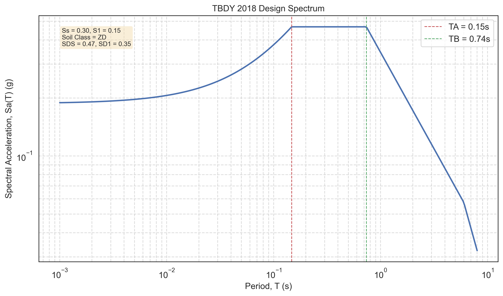

## Initial Motion
- Simple White Noise

### PGA estimation algorithms (optional)
- Sabetta-Pugliese Model
- Graizer-Kalkan 2015
- Campbell & Bozorgnia 2014

### Filters (optional but highly recommended)
- Kanai Tajimi Filter
- Clough Penzien Filter

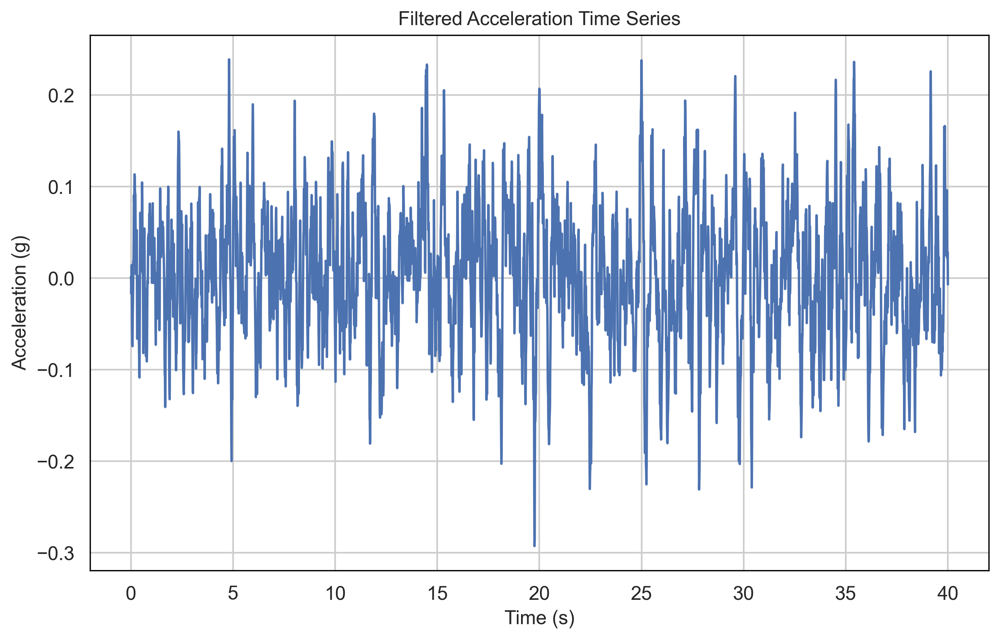

External lib used for low pass filter:

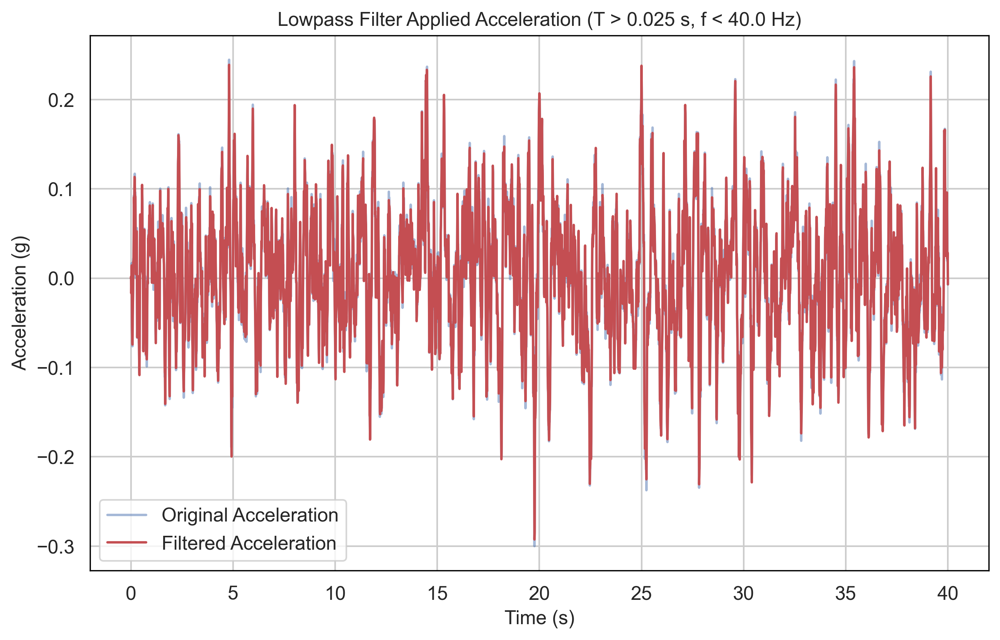

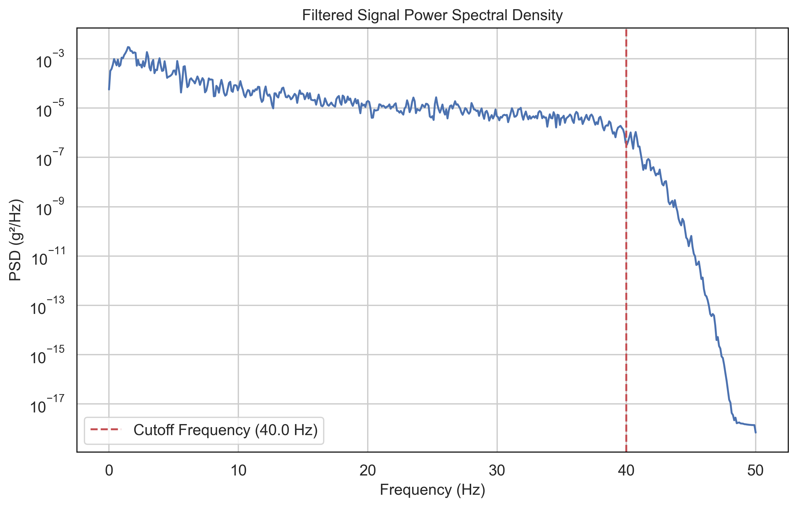

## Enveloping
- Custom envelope 
- Saragoni and Hart envelope function

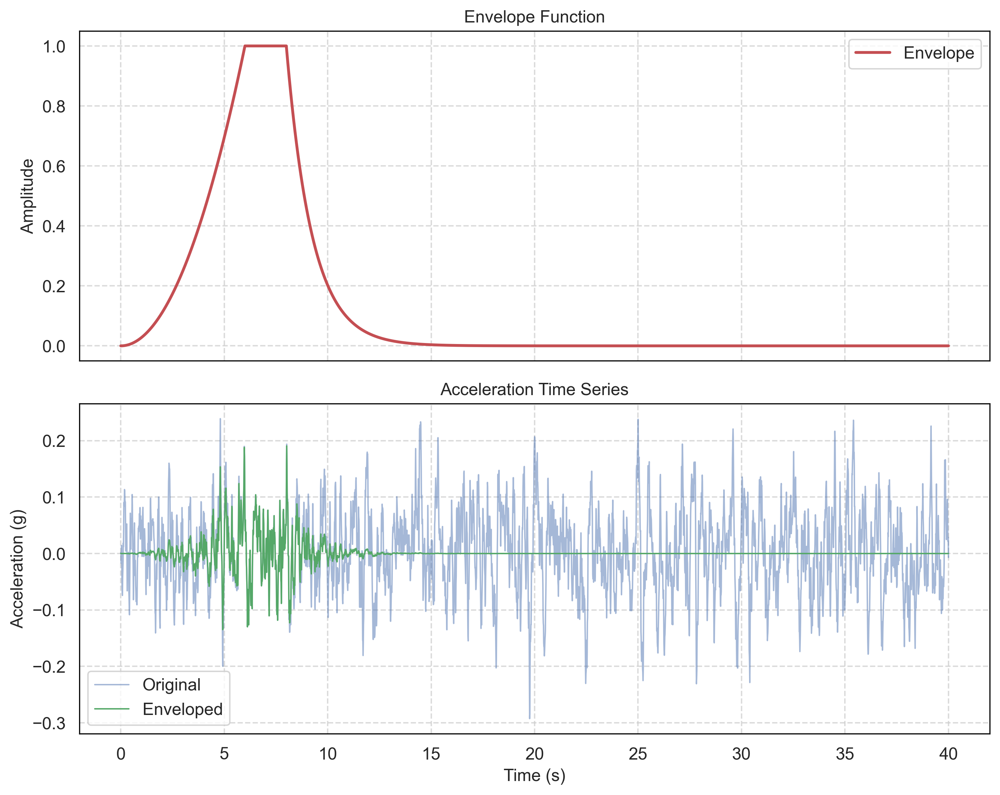

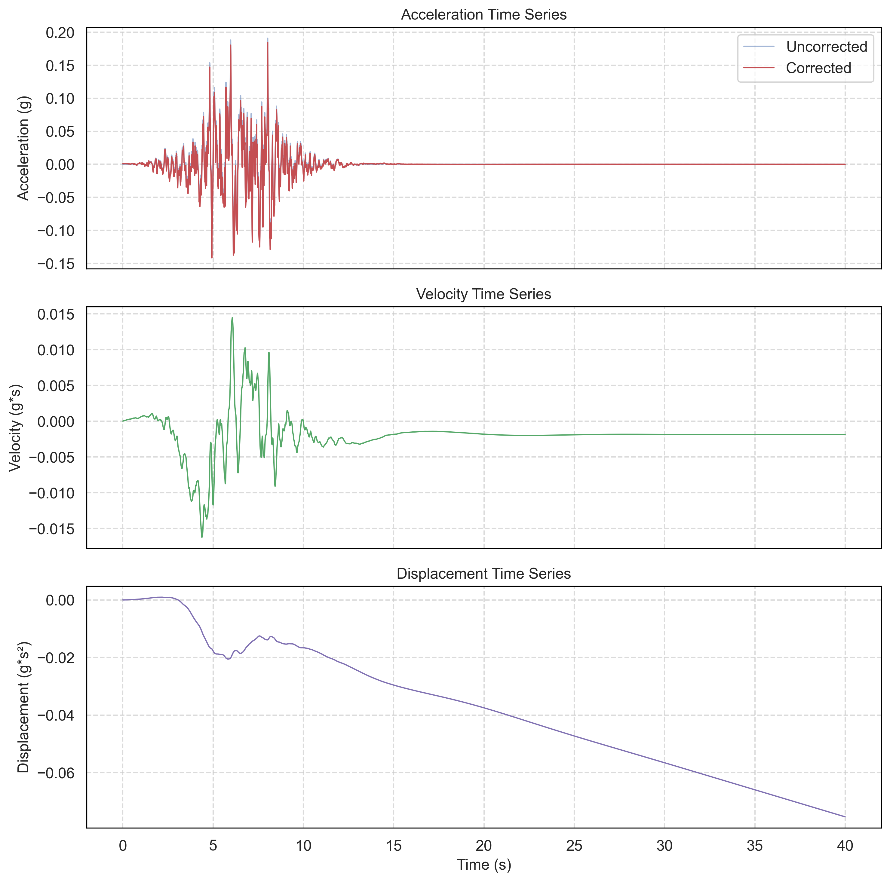

## Spectral Matching Process
There are too many parameters in that class. In most cases, it doesn't need to be tune.

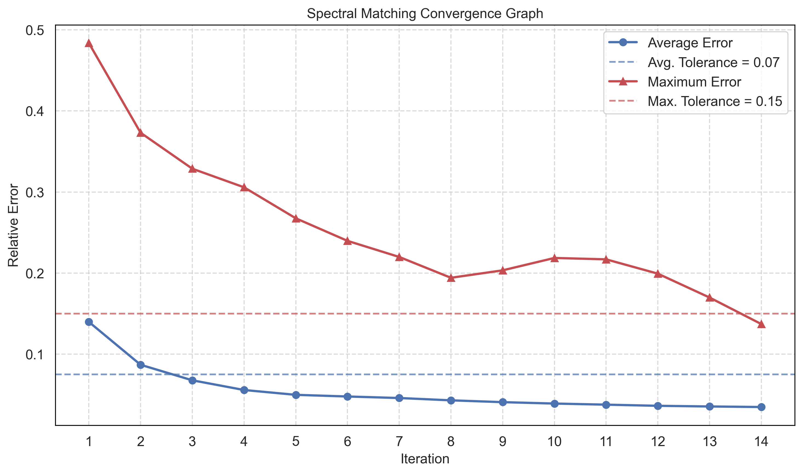

## Results

### Comparison of spectrums
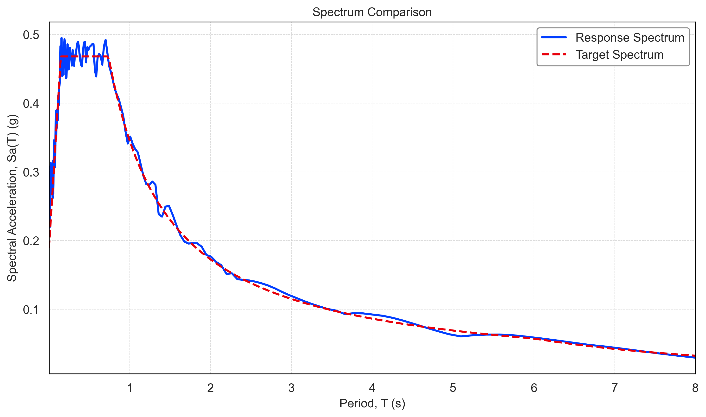

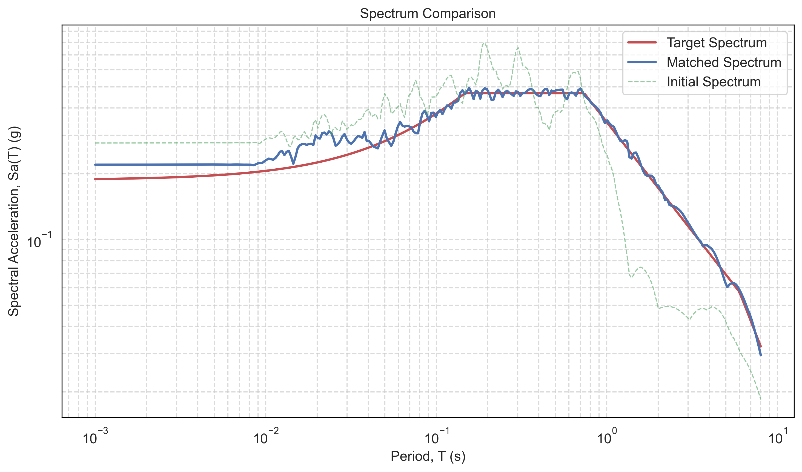

### Spectogram of the motion
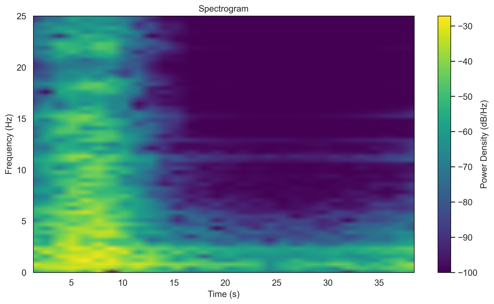

### Final ground motion
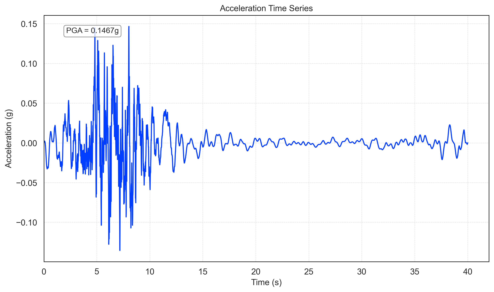
